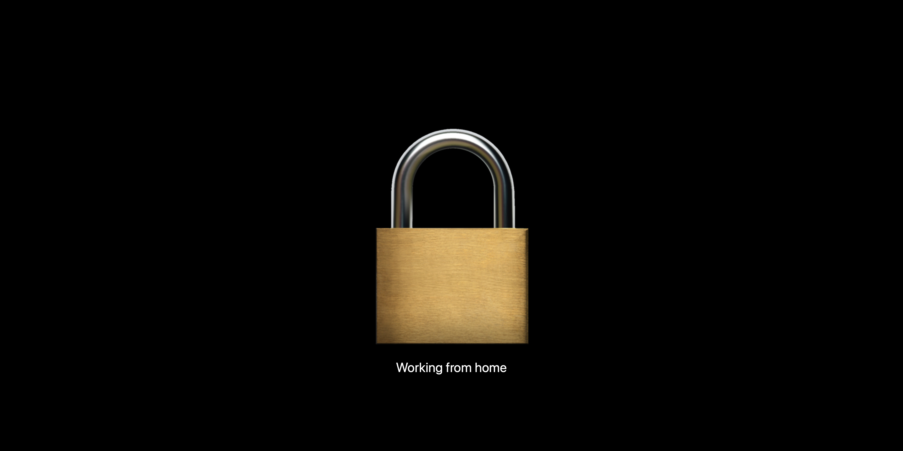

# curtain

Physical screen locking for macOS Screen Sharing based on [franrogers/curtains](https://github.com/franrogers/curtains).



Lock screen while controlling the Mac remotely.

## Installation

```sh
brew install zhuorantan/curtain/curtain
```

## Usage

Lock physical screens and input devices:

```sh
curtain lock -m "Optional message displayed on screen"
```

A confirmation prompt would show to make sure you don't lock yourself out of your Mac. To skip the
prompt, use the `-y` option:

```sh
curtain lock -y
```

To unlock:

```sh
curtain unlock
```

## License

[MIT license](LICENSE)
